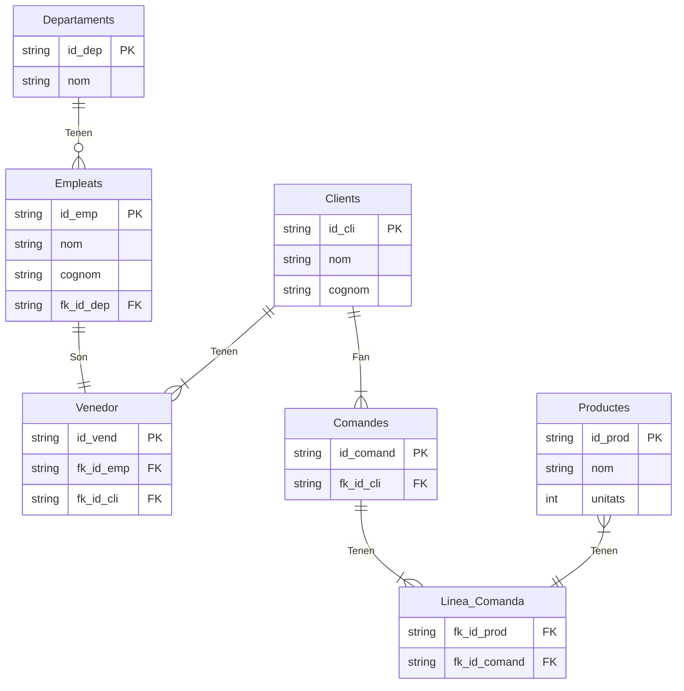

```mermaid
erDiagram
    Departaments  ||--o{ Empleats : Tenen
    Empleats      ||--|| Venedor : Son
    Clients       ||--|{ Venedor : Tenen
    Clients       ||--|{ Comandes : Fan
    Comandes      ||--|{ Linea_Comanda : Tenen
    Productes     |{--|| Linea_Comanda : Tenen


    Departaments {
        string id_dep PK
        string nom
    }

    Empleats {
        string id_emp PK
        string nom
        string cognom
        string fk_id_dep FK
    }
    Clients {
        string id_cli PK
        string nom
        string cognom
    }
    Venedor {
        string id_vend PK
        string fk_id_emp FK
        string fk_id_cli FK
    }
    Comandes{
        string id_comand PK
        string fk_id_cli FK
    }
    Productes{
        string id_prod PK
        string nom
        int unitats
    }
    Linea_Comanda{
        string fk_id_prod FK
        string fk_id_comand FK
    }
```
